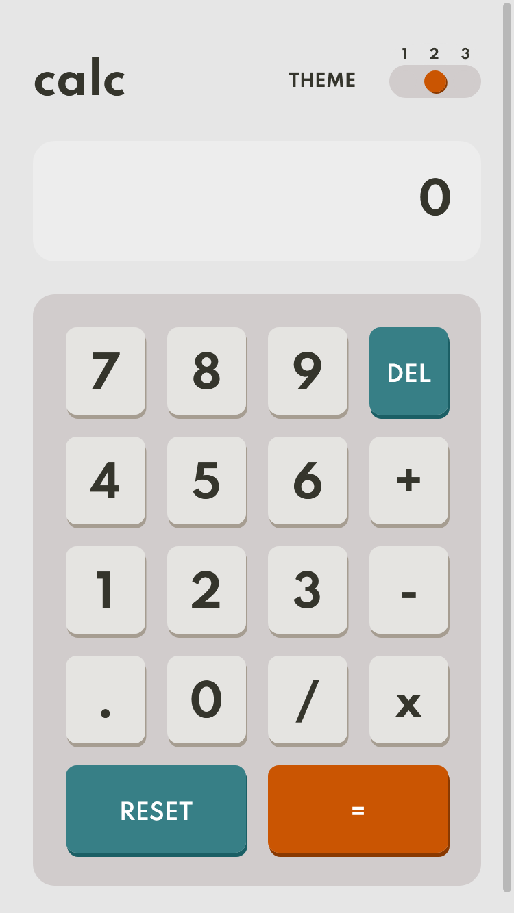
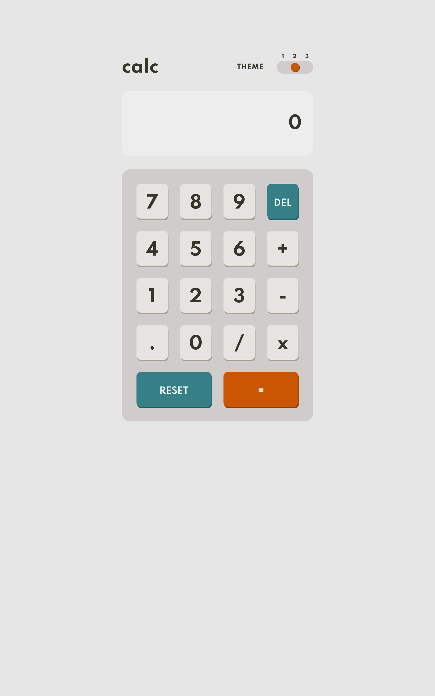
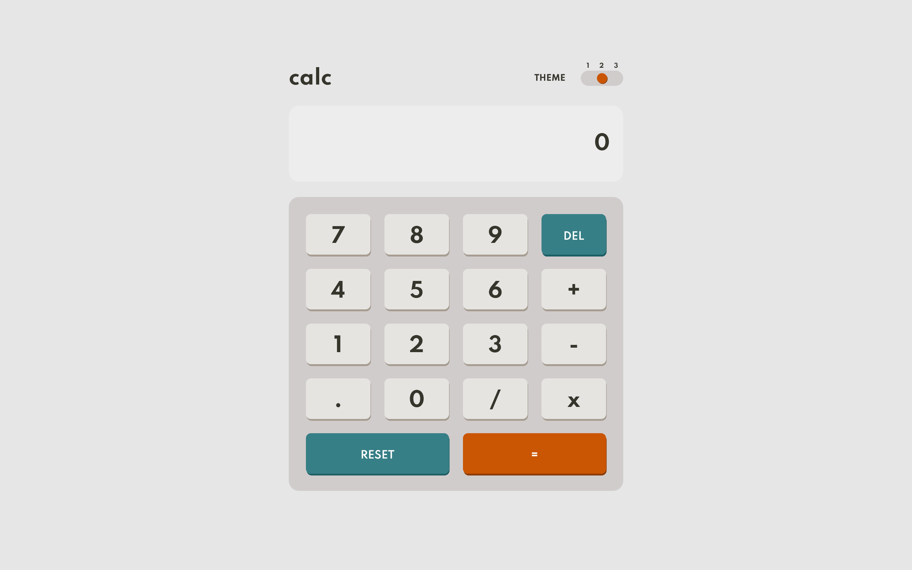
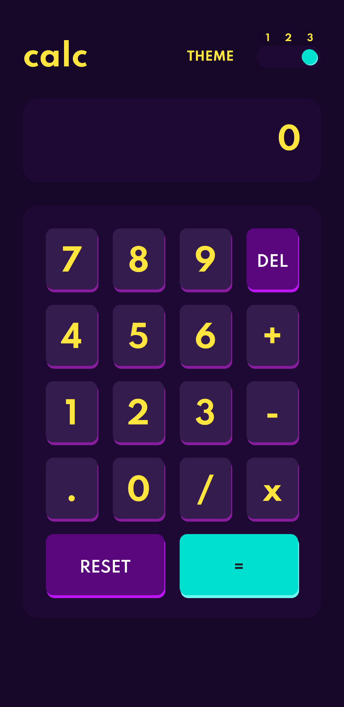
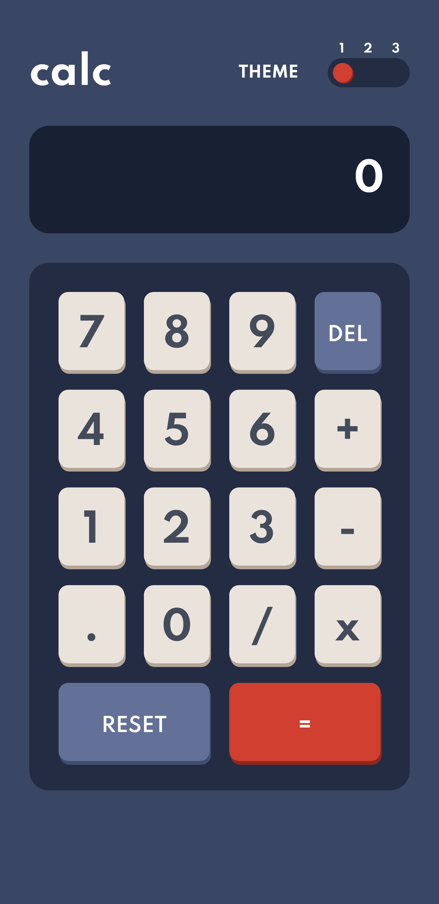

# Frontend Mentor - Calculator app solution

This is a solution to the [Calculator app challenge on Frontend Mentor](https://www.frontendmentor.io/challenges/calculator-app-9lteq5N29). Frontend Mentor challenges help you improve your coding skills by building realistic projects. 

## Table of contents


  - [The challenge](#the-challenge)
  - [Screenshot](#screenshot)
  - [Links](#links)
- [My process](#my-process)
  - [Built with](#built-with)
  - [What I learned](#what-i-learned)
  - [Continued development](#continued-development)
  - [Useful resources](#useful-resources)
- [Author](#author)
- [Acknowledgments](#acknowledgments)


### The challenge

Users should be able to:

- See the size of the elements adjust based on their device's screen size
- Perform mathmatical operations like addition, subtraction, multiplication, and division
- Adjust the color theme based on their preference
- **Bonus**: Have their initial theme preference checked using `prefers-color-scheme` and have any additional changes saved in the browser

### Screenshot








### Links

- Solution URL: [Add solution URL here](https://github.com/RaCode75/calculator_app)
- Live Site URL: [Add live site URL here](https://racode75.github.io/calculator_app/)

### Built with

- Semantic HTML5 markup
- CSS custom properties
- Flexbox
- Mobile-first workflow
- Javascript


### What I learned

Get by 'hand' the them choose for the user and set it in the app.


```js
All the calculator logic is my code with my errors and my hits for learning purposes.
```
### Continued development

I constantly practice and study for go better and better developer.
Only for fun and hobby.
## Author

- Website - [Add your name here](https://www.racode75.com.ar)
- Frontend Mentor - [@yourusername](https://www.frontendmentor.io/profile/racode75)
- Twitter - [@racode75](https://www.twitter.com/racode75)
